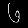
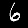
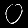
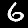
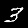

## Demo scripts

These scripts demonstrate how to perform model training

### GAN

### VAE

### Multi-instance
Multiple-instance, or bagged label, problems come up quite often.
The script `mnist_bagged.py` trains a classifier on the bagged MNIST toy dataset.
We pick a "positive" class (or classes), and train on sets of images that either do or do not contain one or more positive examples.

For instance, we choose [0,1,2] to be positive:

**Positive bag** (contains 0,1,2) | **Negative bag** (no 0,1 or 2)
:--: | :--:
 | 

Setting the encoder function to return a binary positive / negative label results in a classifier that determines individual instances, x_i, belonging to the positive set. After only 500 iterations of training batch size 128, and a simple feed-forward model we get good results:

**Classified Positive** | **Classified Negative**
:--: | :--:
 | 
 | 
 | 
 | 
 | 

<!-- If [3,6] are chosen positive, we see more mixups in the individual classifier, while bagged examples remain high accuracy.

**Classified Positive** | **Classified Negative**
:--: | :--:
 | 
 | 
 | 
 | 
 |  -->
