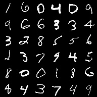
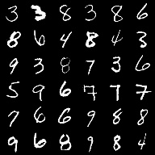
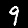

## Multi-instance classifier
Multiple-instance, or bagged label, problems come up quite often.
The script `mnist_bagged.py` trains a classifier on the bagged MNIST toy dataset.
We pick a "positive" class (or classes), and train on sets of images that either do or do not contain one or more positive examples.

For instance, we choose [0,1,2] to be positive:

**Positive bag** (contains 0,1,2) | **Negative bag** (no 0,1 or 2)
:--: | :--:
 | 

### Data
To facilitate training this type of classifier, we have to impose some constraints on the batch generator.
An example implementation of this is in the `BaggedMNIST` dataset class.
This generator is simple enough to implement when data fits in system memory, but the case when examples should be read from disk is not yet addressed.

### Model
The architecture is similar to the examples in [Wang, et al. (2017)](https://arxiv.org/abs/1610.02501).
We process each instance with an convolutinal encoder that outputs a scalar probability (by way of the sigmoid function).
Next, the batch is squished through a multiple instance layer, otherwise known as taking an average along the batch dimension.
If successful, we will have learned to identify positive instances as high values, and negative instances as near-0, so that the bag loss is 0 when all instances are negative, and non-0 when there is at least 1 positive instance in the bag.
Ideally, the classifier will not depend on the number of samples in the bag.
We can test this dependence by training on variable bags with a maximum size, then testing on some larger bags.

### Result

Predicitons for instances:

**Classified Positive** | **Classified Negative**
:--: | :--:
 | 
 | 
 | 
 | 
 | 
